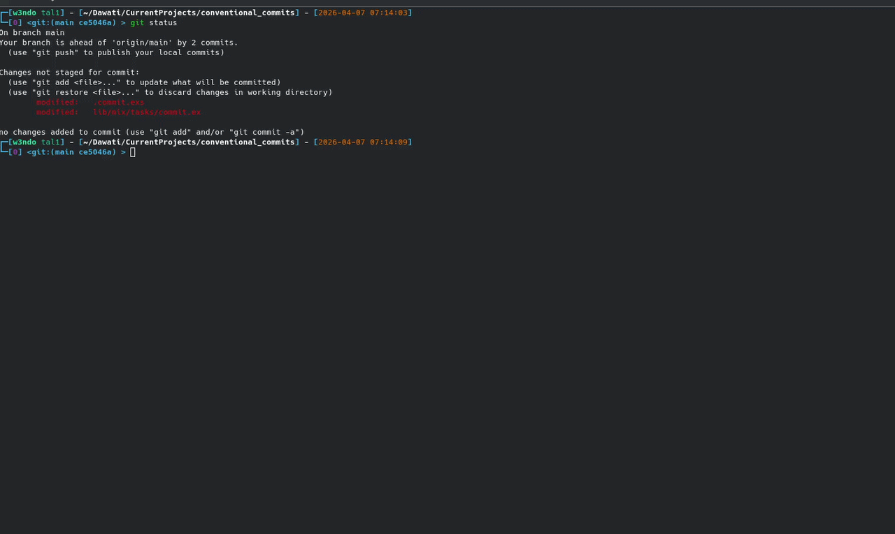

# Conventional Commits



A mix task that allows for conventional commits of the codebase. 

You can read more about conventional commits [here](https://www.conventionalcommits.org/en/v1.0.0/)

A conventional commit message will be structred as

```
<type>[optional scope] : <description>

[optional body]

[optional footer(s)]
```

The purpose of a converntional commit is to communicate intent of your changes to the consumers of your library. Further, by using conventional commits, you make it easier for automated tools to be built within the codebase. 

From [Conventionalcommits.org](https://www.conventionalcommits.org/en/v1.0.0/):

> The commit contains the following structural elements, to communicate intent to the consumers of your library:

    1. fix: a commit of the type fix patches a bug in your codebase (this correlates with PATCH in Semantic Versioning).
    
    2. feat: a commit of the type feat introduces a new feature to the codebase (this correlates with MINOR in Semantic Versioning).
    
    3. BREAKING CHANGE: a commit that has a footer BREAKING CHANGE:, or appends a ! after the type/scope, introduces a breaking API change (correlating with MAJOR in Semantic Versioning). A BREAKING CHANGE can be part of commits of any type.
    
    4. types other than fix: and feat: are allowed, for example @commitlint/config-conventional (based on the Angular convention) recommends build:, chore:, ci:, docs:, style:, refactor:, perf:, test:, and others.
    
    5.footers other than BREAKING CHANGE: <description> may be provided and follow a convention similar to git trailer format.

Additional types are not mandated by the Conventional Commits specification, and have no implicit effect in Semantic Versioning (unless they include a BREAKING CHANGE). A scope may be provided to a commit’s type, to provide additional contextual information and is contained within parenthesis, e.g., feat(parser): add ability to parse arrays.

## Utility of this tool
`mix commit [OPTIONS]`

OPTIONS
### `-h` or `--help`
Opens the help message

### `-t` or `--type` 
Accepts a string that defines the type of commit message. Allowed options are:
`fix`, `feat`, `build`, `chore`, `ci`, `docs`, `style`, `refactor`, `perf` and `test`

### `-f` or `--footer`
A boolean indicating whether the commit has a footer. Can also be specified in the required field in your `.commit.exs` file

## USER DEFINED OPTIONS

### The `.commit.exs` File
If your organisation enforces some required fields in a commit message, you can specify them here. 

```
# Used by "mix commit"
[
  required: [:scope, :body, :footer], # specifies the parts of a commit that must be included. Valid options here are :scope, :body and :footer
  footer_fields: [:author, :reviewed_by, :refs] # specifies the required footer fields.
]
```

This will ensure to ask the user to enter these fields when writing the commit.

## What this mix task doesn't do
1. Push your changes upstream.
2. Add changes to staging. (WIP)